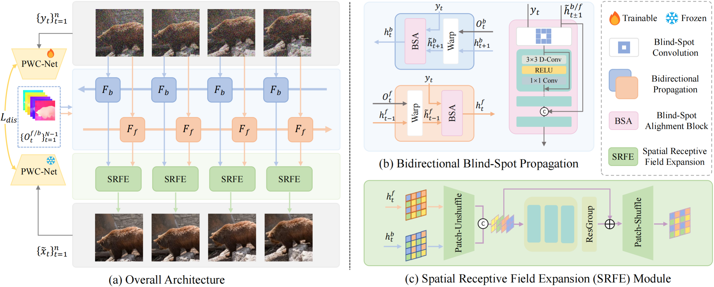
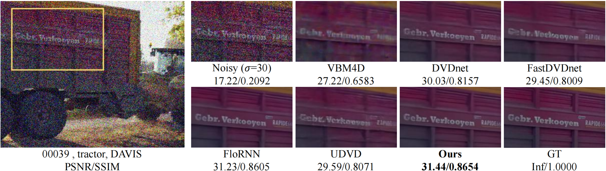

# Spatiotemporal Blind-Spot Network with Calibrated Flow Alignment for Self-Supervised Video Denoising
[](https://arxiv.org/abs/1234.5678)
[](https://github.com/ZKCCZ/STBN/blob/main/LICENSE)
This repository contains the official implementation of our paper "[Spatiotemporal Blind-Spot Network with Calibrated Flow Alignment for Self-Supervised Video Denoising](https://arxiv.org/abs/2412.11820)".

<div align="center">
  <table>
    <tr>
      <td align="center">
        
        
        <p>Noisy (σ=30)</p>
      </td>
      <td align="center">
        
        
        <p>Denoised</p>
      </td>
    </tr>
  </table>
</div>


---

## Abstract

_Self-supervised video denoising aims to remove noise from videos without relying on ground truth data, leveraging the video itself to recover clean frames. Existing methods often rely on simplistic feature stacking or apply optical flow without thorough analysis. This results in suboptimal utilization of both inter-frame and intra-frame information, and it also neglects the potential of optical flow alignment under self-supervised conditions, leading to biased and insufficient denoising outcomes. To this end, we first explore the practicality of optical flow in the self-supervised setting and introduce a SpatioTemporal Blind-spot Network (STBN) for global frame feature utilization. In the temporal domain, we utilize bidirectional blind-spot feature propagation through the proposed blind-spot alignment block to ensure accurate temporal alignment and effectively capture long-range dependencies. In the spatial domain, we introduce the spatial receptive field expansion module, which enhances the receptive field and improves global perception capabilities. Additionally, to reduce the sensitivity of optical flow estimation to noise, we propose an unsupervised optical flow distillation mechanism that refines fine-grained inter-frame interactions during optical flow alignment. Our method demonstrates superior performance across both synthetic and real-world video denoising datasets._



---

## Requirements

- `Python` == 3.8.18
- `cupy` == 8.3.0
- `torch` == 2.1.1
- `torchvision` == 0.16.1
- `matplotlib` == 3.6.2
- `scikit_image` == 0.19.3
- `opencv_python` == 4.9.0.80
- `imageio` == 2.31.4
- `einops` == 0.8.0
- `tqdm` == 4.65.2

---

## Dataset

We follow the dataset structure in [FloRNN](https://github.com/nagejacob/FloRNN). Please click this link for detailed preparation description.

---

## Training

```
usage: python sRGB_train_bsn.py [--model MODEL_NAME] [--lr LEARNING_RATE]
                                [--epochs EPOCHS] [--batch_size BATCH_SIZE]
                                [--noise_ival NOISE_INTERVAL] [--val_noiseL VAL_NOISE_LEVEL]
                                [--milestones MILESTONES] [--log_dir LOG_DIRECTORY]
                                [--trainset_dir TRAINSET_DIRECTORY]
                                [--valset_dir VALIDATIONSET_DIRECTORY]
Arguments:
  --model MODEL_NAME                     Model name to train
  --lr LEARNING_RATE                     Learning rate (default: 3e-4).
  --epochs EPOCHS                        Total number of epochs (e.g., 10).
  --batch_size BATCH_SIZE                Batch size for training (e.g., 4).
  --noise_ival NOISE_INTERVAL            Interval of noise levels for training (e.g., 30 30).
  --val_noiseL VAL_NOISE_LEVEL           Noise level for validation (e.g., 30).
  --milestones MILESTONES                Milestones for learning rate decay (e.g., 2 4 6 8).
  --log_dir LOG_DIRECTORY                Directory for saving logs (e.g., '../logs/test').
  --trainset_dir TRAINSET_DIRECTORY      Directory of the training dataset (e.g., '/data/DAVIS').
  --valset_dir VALIDATIONSET_DIRECTORY   Directory of the validation dataset (e.g., '/data/Set8').
```

You can use `main.sh` for convenience.

---

## Testing

```
usage: python sRGB_test.py [--model MODEL_NAME][--noise_sigmas NOISE_SIGMAS]
                           [--model_file MODEL_FILE_PATH][--test_path TEST_DATASET_PATH]
Arguments:
  --model MODEL_NAME               Name of the model to be tested (e.g., 'bdc_2_unify').
  --noise_sigmas NOISE_SIGMAS      Noise level for testing (e.g., 30).
  --model_file MODEL_FILE_PATH     Path to the pretrained model (e.g., '../logs/pretrained.pth').
  --test_path TEST_DATASET_PATH    Path to the testing dataset (e.g., 'datasets/Set8').
```

You can use `test.sh` for convenience.  
[Here](https://drive.google.com/file/d/1-BohoNxvqclkz-8ZphxQKCJnuMhwfEQp/view?usp=sharing) are our pre-trained weights.

---

## Results

Please refer our paper for more detailed results.


---

## Acknowledgement

The codes are based on [FloRNN](https://github.com/nagejacob/FloRNN) and [PUCA](https://github.com/HyemiEsme/PUCA/). Thanks for the great works.
